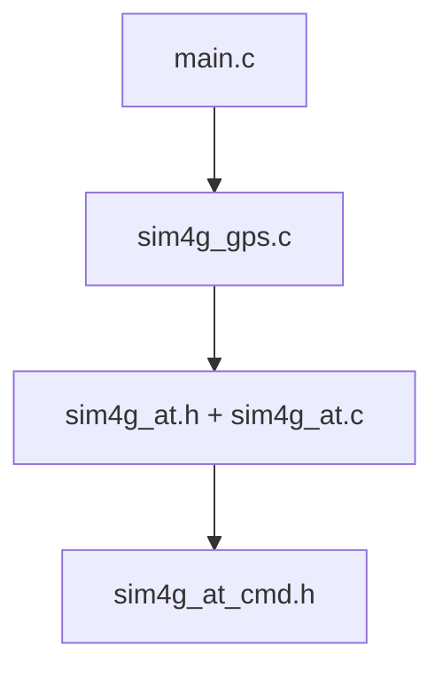

---

## 📂 `components/sim4g_gps/src/` — Mô-đun nội bộ xử lý logic AT và GPS

| Tên file         | Vai trò                                     | Mô tả chi tiết                                                                                                                                                                                                                                                                                                                                               |
| ---------------- | ------------------------------------------- | ------------------------------------------------------------------------------------------------------------------------------------------------------------------------------------------------------------------------------------------------------------------------------------------------------------------------------------------------------------ |
| `sim4g_gps.c`    | 🧠 **Logic cấp cao (High-level API)**       | - Cung cấp API công khai (public) để `main.c` hoặc component khác sử dụng như `sim4g_gps_init()`, `sim4g_gps_get_location()`, `sim4g_gps_set_phone_number()`, `send_fall_alert_sms()`...  - Gọi đến các hàm trong `sim4g_at.c` để thực hiện công việc thực tế qua AT command.  - Là phần **wrapper** cấp cao, không nên chứa chi tiết xử lý AT command |
| `sim4g_at.c`     | ⚙️ **Logic cấp thấp (AT command engine)**   | - Xử lý chi tiết việc gửi AT command đến module EC800K qua UART  - Đọc/parsing phản hồi của module và chuyển thành data usable cho logic cao hơn  - Ví dụ: thực thi `sim4g_at_get_location()`, `sim4g_at_send_cmd()`...                                                                                                                                |
| `sim4g_at.h`     | 📘 **Header khai báo cho sim4g\_at.c**      | - Cung cấp prototype của các hàm trong `sim4g_at.c` để các file khác (đặc biệt `sim4g_gps.c`) có thể gọi  - Là **API nội bộ (internal)** cho component này, không xuất hiện ở ngoài component                                                                                                                                                             |
| `sim4g_at_cmd.h` | 🔠 **Tập lệnh AT command (string literal)** | - Lưu trữ toàn bộ chuỗi command chuẩn như `"AT+CMGF=1"`, `"AT+QGPS=1"`...  - Tách riêng giúp dễ bảo trì, tránh hardcode lặp lại trong `sim4g_at.c`  - Có thể phân loại: GPS, SMS, Network...                                                                                                                                                           |

---

## 🔄 Mối quan hệ hoạt động giữa các file

* `main.c` hoặc component ngoài sẽ chỉ **gọi các hàm trong `sim4g_gps.c`**
* `sim4g_gps.c` sẽ gọi tiếp xuống `sim4g_at.c` để thực hiện logic thấp
* `sim4g_at.c` sẽ sử dụng `sim4g_at_cmd.h` để lấy lệnh AT dạng string

---

## 📌 Tóm tắt nhanh từng file

| File             | Vai trò                                         | Được ai gọi                 | Gọi ai           |
| ---------------- | ----------------------------------------------- | --------------------------- | ---------------- |
| `sim4g_gps.c`    | Public API cho project                          | `main.c`, `fall_logic.c`... | `sim4g_at.c`     |
| `sim4g_at.c`     | Xử lý lệnh AT thực tế                           | `sim4g_gps.c`               | `sim4g_at_cmd.h` |
| `sim4g_at.h`     | Header để `sim4g_gps.c` có thể gọi `sim4g_at.c` | `sim4g_gps.c`               | Không            |
| `sim4g_at_cmd.h` | Lưu AT command (string hằng số)                 | `sim4g_at.c`                | Không            |

---

